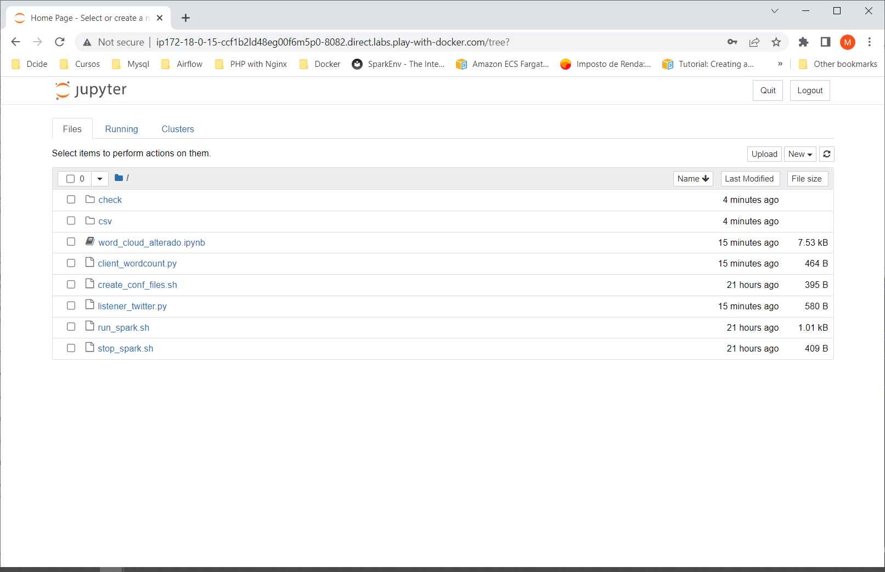

# Jupyter client running into Standalone cluster in Docker

Apache Spark is an open-source, distributed processing system used for big data workloads.

In this demo, a Spark container uses a Spark Standalone cluster as a resource management and job scheduling technology to perform distributed data processing.

This Docker image contains Spark binaries prebuilt and uploaded in Docker Hub.

## Steps to Build Spark image
```shell
$ git clone https://github.com/mkenjis/apache_binaries
$ wget https://archive.apache.org/dist/spark/spark-3.0.3/spark-3.0.3-bin-hadoop2.7.tgz
$ docker image build -t mkenjis/ubpyspk_stream_img
$ docker login
Login with your Docker ID to push and pull images from Docker Hub. If you don't have a Docker ID, head over to https://hub.docker.com to create one.
Username: mkenjis
Password: 
WARNING! Your password will be stored unencrypted in /root/.docker/config.json.
Configure a credential helper to remove this warning. See
https://docs.docker.com/engine/reference/commandline/login/#credentials-store

Login Succeeded
$ docker image push mkenjis/ubpyspk_stream_img
```

## Shell Scripts Inside 

> run_spark.sh

Sets up the environment for Spark client by executing the following steps :
- sets environment variables for JAVA and SPARK
- starts the SSH service for passwordless SSH files on start-up

> create_conf_files.sh

Creates the following Hadoop files on $SPARK_HOME/conf directory :
- spark-env.sh

## Initial Steps on Docker Swarm

To start with, start Swarm mode in Docker in node1
```shell
$ docker swarm init
Swarm initialized: current node (xv7mhbt8ncn6i9iwhy8ysemik) is now a manager.

To add a worker to this swarm, run the following command:

    docker swarm join --token <token> <IP node1>:2377

To add a manager to this swarm, run 'docker swarm join-token manager' and follow the instructions.
```

Add more workers in cluster hosts (node2, node3, ...) by joining them to manager.
```shell
$ docker swarm join --token <token> <IP node1>:2377
```

Change the workers as managers in node2, node3, ...
```shell
$ docker node promote node2
$ docker node promote node3
$ docker node promote ...
```

Start Docker stack using docker-compose.yml
```shell
$ docker stack deploy -c docker-compose.yml spark
```

Check the status of each service started
```shell
$ docker service ls
ID             NAME             MODE         REPLICAS   IMAGE                             PORTS
t3s7ud9u21hr   spark_spk_mst    replicated   1/1        mkenjis/ubpyspk_img:latest   
mi3w7xvf9vyt   spark_spk_wkr1   replicated   1/1        mkenjis/ubpyspk_img:latest   
xlg5ww9q0v6j   spark_spk_wkr2   replicated   1/1        mkenjis/ubpyspk_img:latest   
ni5xrb60u71i   spark_spk_wkr3   replicated   1/1        mkenjis/ubpyspk_img:latest
```

## Running Spark shell in Spark Docker container

Identify which Docker container started as Spark master and logged into it
```shell
$ docker container ls   # run it in each node and check which <container ID> is running the Hadoop master constainer
CONTAINER ID   IMAGE                         COMMAND                  CREATED              STATUS              PORTS      NAMES
71717fcd5a01   mkenjis/ubpyspk_img:latest   "/usr/bin/supervisord"   14 minutes ago   Up 14 minutes   4040/tcp, 7077/tcp, 8080-8082/tcp, 10000/tcp   spark_spk_wkr2.1.bf8tsqv5lyfa4h5i8utwvtpch
464730a41833   mkenjis/ubpyspk_img:latest   "/usr/bin/supervisord"   14 minutes ago   Up 14 minutes   4040/tcp, 7077/tcp, 8080-8082/tcp, 10000/tcp   spark_spk_mst.1.n01a49esutmbgv5uum3tdsm6p

$ docker container cp client_wordcount.py <container ID>:/root
$ docker container cp listener_twitter.py <container ID>:/root
$ docker container cp word_cloud_comentado.ipynb <container ID>:/root

$ docker container exec -it <container ID> bash
```

Run jupyter notebook --generate-config
```shell
$ jupyter notebook --generate-config
```

Edit /root/.jupyter/jupyter_notebook_config.py
```shell
$ vi /root/.jupyter/jupyter_notebook_config.py
c.NotebookApp.ip = '*'
c.NotebookApp.open_browser = False
c.NotebookApp.port = 8082
```

Setup a jupyter password
```shell
$ jupyter notebook password
Enter password:  *********
Verify password: *********
```

Run pyspark
```shell
PYSPARK_DRIVER_PYTHON_OPTS="notebook --no-browser --allow-root --port=8082" pyspark --master local[*]
```

In the browser, issue the address https://host:8082 to access the Jupyter Notebook.

Provide the credentials previously created


Click on New button to start a new notebook. Choose Python3 as interpreter



Issue Spark commands


